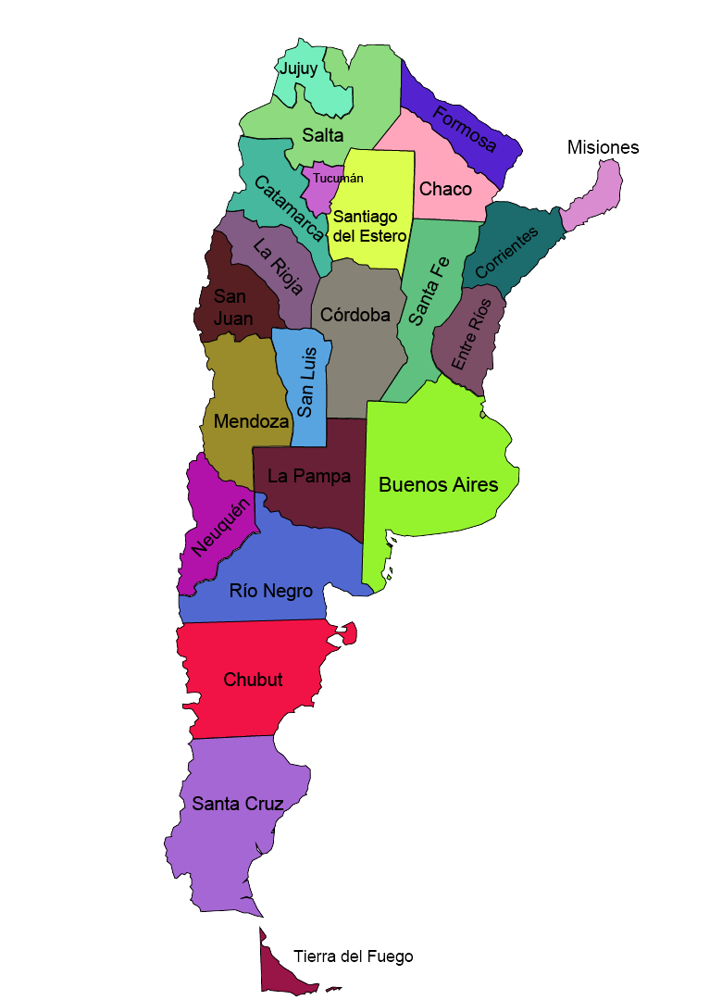

### **DESCRIPCION**
Analisis completo a travez del Ente Nacional de Comunicaciones (ENACOM) de Argentina (organismo regulador de las telecomunicaciones en Argentina). Con el fin de buscar oportunidades de mejora, KPI'S entre otros.

<div id="header" align="center">
  
</div>

### **TABLA DE CONTENIDO**
## Tabla de contenido
1. [Introducción](#introducción)
2. [Instalación y Requisitos](#instalación-y-requisitos)
3. [Estructura del Proyecto](#estructura-del-proyecto)
4. [Uso y Ejecución](#uso-y-ejecución)
5. [Datos y Fuentes](#datos-y-fuentes)
6. [Metodología](#metodología)
7. [Resultados y Conclusiones](#resultados-y-conclusiones)
8. [Contribución y Colaboración](#contribución-y-colaboración)
9. [Autores](#autores)

### **Introducción**


El internet ha venido revolucionado las telecomunicaciones, transformando la comunicación de limitada y lenta a instantánea y global. Ha permitido el intercambio de información en tiempo real, el acceso a recursos en línea y la creación de nuevas industrias. 

Ahora no es nada extraño encontrar cada año noticias con titulares como:

 "*El Gobierno argentino confirmó nuevos aumentos a partir de 2023 para los servicios de televisión paga, telefonía e internet. A través del Ente Nacional de Comunicaciones (Enacom), estableció...*

A partir de lo anterior puede surgir una pregunta bien interesante.
¿Que es el ENACOM y como influye en el aumento y disminucion de la tasa de cobro por servicios? 

En este proyecto vamos a resolver esta pregunta y llevarla mas allá, plantenado opciones de mejora a partir de dasboards interactivos, opotunidades de crecimiento y KPI's.

### **Instalación y requisitos**

- Python 3.7 o superior
- Todas las librerias usadas las encuentras en el archivo "requirements.txt"
- Power BI (ultimas versiones de preferencia)

### **Estrucutra del proyecto**
Una vez entendido las necesidades de nuestro cliente procedemos a diseñar la estructura del proyecto sobre la que se sontendrá todo el desarrollo y exito del mismo.

### **Uso y Ejecución**

### **Metodología**
Antes de comenzar con la primera etapa del proyecto y descargar todos los datos para el proyecto procederemos a realizar una pequeña pero importante etapa previa a la ingesta de datos.

**Consolidacion de Datos**
>En esta etapa filtraremos cual data será relevante para nuestro EDA y cual no, usaremos un cojunto de dataset para el conjunto de datos principales relacionados al internet y uno complementario que nos peuda servir de utilidad para brindarnos informacioón util. Para ello haremos uso del diccionario de datos.

- Solo 2 hojas de las 15 contienen datos NO relacionados al trimestre. Esta columna tiene incidencia directa en un 86% aproximadamente.
- La columna 'Link Indec' es un identificador relacionado con las localidades, se revisará la cantidad de duplicados.
- Un mapa de datos segun la provincia nos puede entregar valores utiles. Para ello tendremos en cuenta el mapa argentino.

<div id="header" align="center">
  
</div>

- Con la columna link indec relacionaremos el numero de velocidades mas bajas con la tecnologia, asi como la tecnologia que esta produciendo mejores resultados de velocidad.
- Asi mismo identificaremos la provincia con mayores usuarios de internet bajo.


 1. pk link idec  (tecnologia mas lenta)
 2. eliminada
 3. mapa Mbps x provincia x tiempo 
 4. eliminada
 5. fk link indec
 6. eliminada por falta de tecnologias
 7. elimnada
 8. eliminada 
 9. eliminada
 10. mapa poblacion x provincia x tiempo (penetracion)
 11. mapa hogares x provincia x tiempo (penetracion)
 12. diagrama de barras doble (hogares-poblacion)
 13. eliminada
 14. Grafica interesante (hacer al final) totales y luego velocidades
 15. Grafica de barras

- **Conjunto Principal: (CP)**
  1. acc_vel_loc_sinrangos
  2. Velocidad % por prov
  3. Accesos_tecnologia_localidad
  4. Penetración-poblacion
  5. Penetracion-hogares
  6. Penetracion totales
  7. Accesos por velocidad
  8. Ingresos

- **Conjunto Complementario: (CC)**
  - portabilidad
    1. Portin
  - servicios postales

    2. unidades_telegraficas
    3. unidades_monetarios
  - telefonia fija

    4. Fija_ingresos

1. **Ingesta de datos**

Tanto en el EDA como en ETL haremos una ingesta de todos las hojas de excel y las dividiremos por df correspondientes.

Primero guardamos todos los archivos de excel en variables para poderlas manipular.

```
internet = basepath + 'data/Internet.xlsx'
portabilidad = basepath + 'data/Portabilidad.xlsx'
servicios_postales = basepath + 'data/servicios_postales.xlsx'
telefonia_fija = basepath + 'data/Telefonia_fija.xlsx'
```

Nuestra variable 'basepath' está definida por la ruta de nuestro directorio que nos lleva hasta la carpeta que contiene los archivos. ejemplo:

```
C:/User/Personal/Desktop/
```

Creamos los dataframes. 
- 8 para el archivo Internet.
- 4 para archivos complementarios.

Total 12 dataframes.

```
df_CP1 = pd.read_excel(internet ,sheet_name= 'Acc_vel_loc_sinrangos')
df_CP2 = pd.read_excel(internet ,sheet_name= 'Velocidad % por prov')
df_CP3 = pd.read_excel(internet ,sheet_name= 'Accesos_tecnologia_localidad')
df_CP4 = pd.read_excel(internet ,sheet_name= 'Penetración-poblacion')
df_CP5 = pd.read_excel(internet ,sheet_name= 'Penetracion-hogares')
df_CP6 = pd.read_excel(internet ,sheet_name= 'Penetracion-totales')
df_CP7 = pd.read_excel(internet ,sheet_name= 'Accesos por velocidad')
df_CP8 = pd.read_excel(internet ,sheet_name= 'Ingresos')

df_CC1 = pd.read_excel(portabilidad ,sheet_name= 'Portin')
df_CC2 = pd.read_excel(servicios_postales ,sheet_name= 'unidades_telegraficas')
df_CC3 = pd.read_excel(servicios_postales ,sheet_name= 'unidades_monetarios')
df_CC4 = pd.read_excel(telefonia_fija ,sheet_name= 'Fija_ingresos')
```

2. **ETL Database**
3. **EDA Database + Analisis**
4. **Dasboard KPI + Analisis**
5. **Preparación DEMO**

### **Resultados y conclusiones**

### **Contribucion y colaboración**
¡Gracias por considerar contribuir a este proyecto! Valoramos y damos la bienvenida a las contribuciones de la comunidad. Si tienes ideas para mejorar la estructura del proyecto o cualquier otra sugerencia, no dudes en proponer cambios.

<div id="header" align="center">
  
</div>

### **Autores**
Gustavo Pardo Bermudez / Data Analist


